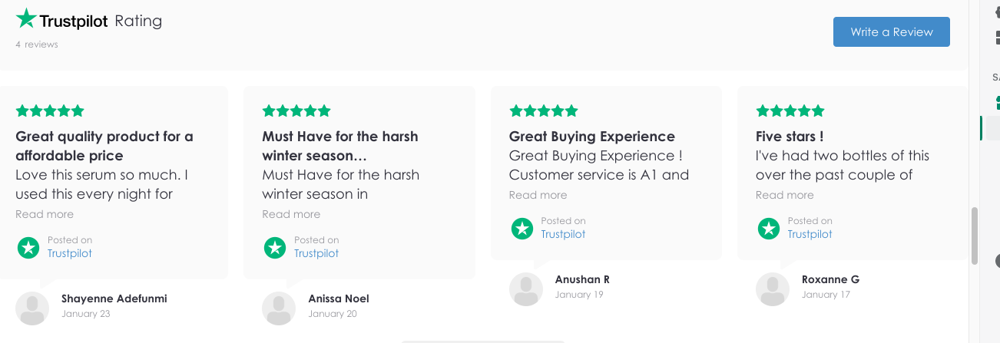

<!-- PROJECT LOGO -->
 

    

  </a>

  <h1 align="center">Project Nuit D'Été</h3>

  

    Redesigned and transformed existing website into a highly functional eCommerce site utilizing Shopify's platform
     
  

<!-- ABOUT THE PROJECT -->
## About The Project

The journey began after my colleague approached me after the initial launch of her skincare brand, Nuit D'Été. With no experience in web development or eCommerce, she struggled to create a website that parallels her brand's vision and what she envisioned for her skincare line. Having no prior experience in eCommerce or the Shopify platform, I decided to take on the project and learn as much as I could regarding how to produce a winning website. Here's how I planned to succeed in the process.. 

* Stay away from generic shopify themes to avoid brand dilution
* Leverage external plugins to increasce sales and drive engagement
* Redesign website aesthetic to parallel brands mission and culture. 

After watching countless youtube videos and immersing myself in the world of eCommerce and Shopify success, I was ready to start this project and start my journey! 

(<a href="#top">back to top</a>)

<!-- GETTING STARTED -->
## The Build

Here are some of the highlights of the website
### Trustpilot API

* In order to incorporate social proof, I leveraged TrustPilot's API to automate review collection after purchase within a designated time frame. The result of this was a increase customer reviews by 300%
  

### 3D Model

* Worked in collaboration with a 3D animator to capture the flagship product, the "Essencial Serum". 
  

### Mobile Responsiveness 

* Knowing that the majority of customers will be viewing the site on a mobile platform, I prioritized planning out a seamless yet engaging mobile experience.
   
  

<i>Accordion Menu for Ingredients</i>

(<a href="#top">back to top</a>)

<!-- USAGE EXAMPLES -->
## In Action Links
Check out the a full walkthorugh of the site as well as the completed 3D model and video creative. 

(<a href="#top">back to top</a>)

_[Site Walkthrough](https://youtu.be/w4yJuXodYCo)_

_[The Video Ad (with 3D Model)](https://youtu.be/7MLsu8xwYK4)_

<!-- CONTACT -->
## Contact

Anushan R - contact@anushanr.com

(<a href="#top">back to top</a>)

